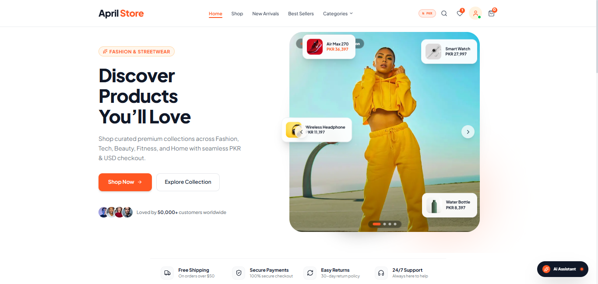

# April Store — Intelligent Modern E-Commerce Platform



[](https://aprilstore-one.vercel.app/)
[](https://nextjs.org/)
[](https://react.dev/)
[](https://www.typescriptlang.org/)
[](https://tailwindcss.com/)
[](https://www.sanity.io/)
[](https://firebase.google.com/)
[](https://aistudio.google.com/)

**April Store** is a full-featured, production-ready e-commerce web platform engineered with **Next.js 15 (App Router)**, **React 19**, **TypeScript**, and **Tailwind CSS v4**. Live demo: **[aprilstore-one.vercel.app](https://aprilstore-one.vercel.app/)**.


The platform features an embedded headless CMS via **Sanity Studio (`/studio`)**, cloud database sync with **Cloud Firestore**, one-click **Google Authentication**, real-time **USD / PKR currency conversion**, and an interactive **dual-slider price filter**.

---

## 🌟 Key Features

### 🛍️ Storefront & Customer Experience
- **Interactive Hero Section:** Dynamic showcase with floating product cards, quick preview badges, and smooth animations.
- **Responsive New Arrivals Carousel:** Fluid multi-card carousel engineered with touch pan swiping, peek view on mobile devices, and zero horizontal viewport overflow.
- **Interactive Catalog & Slider Filtering:**
  - Category selector with active pill indicators.
  - **Dual-Slider Price Range Control** with synchronized numeric inputs and quick price preset buttons.
  - Multi-select size filter chips (`XS`, `S`, `M`, `L`, `XL`, `One Size`).
  - Active filter tags bar with one-click individual dismissal and "Clear all" reset.
  - Segmented desktop sort controls and mobile sort dropdown.
- **Dual-Currency Conversion Engine:** Instant client-wide toggling between **USD ($)** and **PKR (Rs.)** with real-time rate conversion across all prices and cart totals.
- **Persistent Cart & Wishlist:** Slide-over cart drawer, quantity adjustment, instant badges, and cross-session persistence via Zustand.
- **Product Reviews System:** Full review submission connected directly to Cloud Firestore with live deduplication and community rating averages.

### 🤖 Intelligent AI Capabilities (Google Gemini)
- **AI Style Concierge (`/api/ai/chat`):** Personal shopping assistant capable of recommending outfits, suggesting complementary accessories, advising on sizing, and answering store policies.
- **Semantic Smart Search (`/api/ai/search`):** Natural language query parser (e.g., *"comfortable linen shirt for summer vacation under $60"*) returning matching products from the catalog.
- **Bank Transfer Receipt Verification (`/api/ai/verify-receipt`):** Multimodal Gemini 2.5 Flash Vision engine that analyzes uploaded bank receipts (Meezan Bank, HBL, SadaPay, NayaPay, JazzCash, EasyPaisa, etc.) to extract transfer amounts, transaction references, dates, and verification confidence.

### 📝 Headless CMS & Back-Office (Sanity Studio)
- **Embedded Sanity Studio:** Fully integrated CMS available at `/studio` for editing products, categories, images, and inventory.
- **Bidirectional Product Sync:** Next.js API route (`/api/products`) and server-side writer (`lib/sanity/writer.ts`) mutate and synchronize product records directly with Sanity CMS.
- **Admin Dashboard (`/dashboard`):** Business overview, real-time revenue analytics, order management, and catalog inventory controls.

### 🔐 Authentication & Role Management
- **Google Sign-In:** One-click popup authentication via Firebase GoogleAuthProvider.
- **Email & Password Auth:** Secure login and registration with validation feedback.
- **Address Book Management:** Full multi-address saving, default address selection, and delete capabilities synced to Firestore and local storage.
- **Identity-Preserving Role Switching:** Instant switching between `Customer` and `Admin` roles while strictly preserving the logged-in user's credentials.

### 💳 Checkout & Settlement
- **Cash on Delivery (COD):** Frictionless local settlement flow.
- **Direct Bank Transfer:** Complete payment workflow displaying bank credentials, reference codes, and the AI multimodal receipt scanning verification module.

---

## 🏗️ Technical Architecture

| Layer | Technology | Description |
| :--- | :--- | :--- |
| **Framework** | [Next.js](https://nextjs.org/) `15.2.0` | App Router with Server Components, Static Site Generation, and API Routes |
| **UI Engine** | [React](https://react.dev/) `19.2.1` | Concurrent rendering, state orchestration, and server actions |
| **Language** | [TypeScript](https://www.typescriptlang.org/) `5.9.3` | Strict end-to-end static type safety |
| **Styling** | [Tailwind CSS](https://tailwindcss.com/) `v4` | Utility-first CSS engine with custom `@theme` tokens |
| **Headless CMS** | [Sanity Studio](https://www.sanity.io/) `v3` / `next-sanity` | Embedded content management and product mutations |
| **Database & Auth** | [Firebase](https://firebase.google.com/) `12.18.0` | Cloud Firestore, Firebase Authentication (Google & Email), with local storage fallback |
| **Artificial Intelligence** | [@google/genai](https://www.npmjs.com/package/@google/genai) `2.4.0` | Google Gemini 2.5 Flash for chat, semantic search, and receipt OCR |
| **State Management** | [Zustand](https://zustand-demo.pmnd.rs/) `5.0.15` | Reactive stores for cart, wishlist, currency, and UI modals |
| **Forms & Validation** | React Hook Form & [Zod](https://zod.dev/) | Type-safe form controls and schema validation |

---

## 📁 Project Structure

```
├── app/
│   ├── (shop)/                  # Storefront route group
│   │   ├── account/             # Customer profile, addresses & Google login
│   │   ├── cart/                # Dedicated cart view
│   │   ├── checkout/            # Checkout form & bank transfer receipt upload
│   │   ├── orders/              # Order confirmation & status tracking
│   │   ├── products/            # Catalog with slider filtering & PDP pages
│   │   └── wishlist/            # Customer wishlist
│   ├── api/                     # Backend API handlers
│   │   ├── ai/
│   │   │   ├── chat/            # Gemini AI Style Concierge endpoint
│   │   │   ├── search/          # Semantic natural-language search endpoint
│   │   │   └── verify-receipt/  # Multimodal Gemini receipt OCR endpoint
│   │   └── products/            # Sanity CMS product mutation API endpoint
│   ├── dashboard/               # Administrative back-office console
│   │   ├── categories/          # Admin category management
│   │   ├── orders/              # Admin order management & receipt audit
│   │   └── products/            # Admin product inventory CRUD
│   ├── studio/                  # Embedded Sanity Studio CMS route (`/studio`)
│   ├── globals.css              # Global styles, animations & range slider theme
│   ├── layout.tsx               # Root layout with SEO metadata & JSON-LD schema
│   └── page.tsx                 # Homepage with Hero, Categories & New Arrivals
├── components/                  # Reusable UI component library
│   ├── ai/                      # AI Style Assistant widget & search suggestions
│   ├── auth/                    # Auth modal with Google Sign-In button
│   ├── cart/                    # Cart drawer, items list, and summary
│   ├── checkout/                # Checkout forms & receipt uploader
│   ├── home/                    # Hero section, categories, new arrivals carousel
│   ├── layout/                  # Navbar, footer, and mobile drawer
│   ├── order/                   # Order cards, status badges, and timeline
│   ├── product/                 # ProductCard, dual-slider filters, reviews
│   └── ui/                      # Base buttons, inputs, toast, modals, badges
├── hooks/                       # Custom hooks (useAuth, useCart, useProducts, etc.)
├── lib/
│   ├── data/                    # Seed catalog products and categories
│   ├── firebase/                # Firebase Auth, Firestore, and config
│   ├── gemini/                  # Google GenAI client and prompt handlers
│   ├── sanity/                  # Sanity client, queries, image URL builder, and writer
│   └── utils/                   # Formatting, helpers, and validators
├── public/                      # Static assets & hero preview banner
├── sanity/                      # Sanity CMS schema definitions
├── store/                       # Zustand stores (cart, currency, wishlist, ui)
├── types/                       # TypeScript interfaces and data models
├── .env.example                 # Sanitized environment variables template
├── .gitignore                   # Comprehensive secrets and build outputs ignore list
└── package.json                 # Dependencies and build scripts
```

---

## 🚀 Getting Started

### Prerequisites
- **Node.js**: `v20.0` or higher
- **npm**: `v10.0` or higher

### 1. Clone & Install Dependencies
```bash
git clone https://github.com/<your-username>/april-store.git
cd april-store
npm install
```

### 2. Configure Environment Variables
Copy `.env.example` to `.env.local`:
```bash
cp .env.example .env.local
```

Populate the required credentials in `.env.local`:
```env
# Google Gemini AI Key (Required for AI assistant, search, and receipt OCR)
# Get from: https://aistudio.google.com/app/apikey
GEMINI_API_KEY="AIzaSyYourGeneratedGeminiKey"

# App URL
APP_URL="http://localhost:3000"
NEXT_PUBLIC_APP_URL="http://localhost:3000"

# Firebase Client Configuration (Optional - falls back to resilient local persistence)
# Get from: https://console.firebase.google.com/
NEXT_PUBLIC_FIREBASE_API_KEY=""
NEXT_PUBLIC_FIREBASE_AUTH_DOMAIN=""
NEXT_PUBLIC_FIREBASE_PROJECT_ID=""
NEXT_PUBLIC_FIREBASE_STORAGE_BUCKET=""
NEXT_PUBLIC_FIREBASE_MESSAGING_SENDER_ID=""
NEXT_PUBLIC_FIREBASE_APP_ID=""

# Sanity Studio CMS Configuration
# Get from: https://www.sanity.io/manage
NEXT_PUBLIC_SANITY_PROJECT_ID=""
NEXT_PUBLIC_SANITY_DATASET="production"
NEXT_PUBLIC_SANITY_API_VERSION="2025-01-01"
SANITY_API_TOKEN=""
```

### 3. Run Development Server
```bash
npm run dev
```
Open [http://localhost:3000](http://localhost:3000) to view the storefront.  
Access Sanity Studio at [http://localhost:3000/studio](http://localhost:3000/studio).

### 4. Build for Production
```bash
npm run build
npm run start
```

---

## 🔒 Security & GitHub Push Checklist

Before pushing this repository to GitHub:
- [x] **No Hardcoded Secrets**: All API keys, tokens, and credentials are read via `process.env`.
- [x] **`.gitignore` Enforced**: `.env`, `.env.local`, `.env*.local`, `node_modules`, `.next`, and build caches are strictly ignored.
- [x] **Sanitized Template**: `.env.example` contains only empty string placeholders and setup instructions.
- [x] **Strict Type Safety**: `npx tsc --noEmit` compiles cleanly with zero errors.
- [x] **Production Build**: `npm run build` compiles all 19 static and dynamic routes with exit code 0.
- [x] **Dead Code Purged**: Unused webhook mock routes and references to unused payment gateways removed.

---

## 🔑 Administrative Access

To access the back-office management console:
1. Navigate to `/dashboard` or click the user account icon in the header.
2. Sign in with administrative credentials:
   - **Email:** `admin@aprilstore.com`
   - **Password:** `admin123`
3. Manage products, review customer orders, inspect AI OCR receipt verification, and open the embedded Sanity Studio at `/studio`.

---

## 📄 License

This project is licensed under the MIT License.
